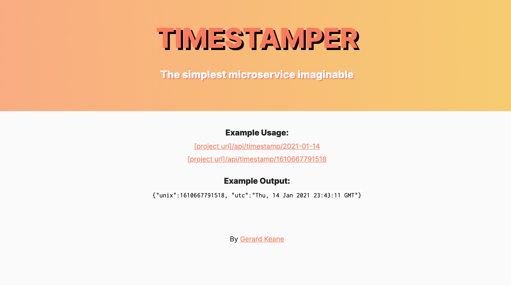

# Timestamper

The simplest microservice imaginable. Timestamper surfaces an API which:

- returns a json object with the current unix time and utc time
- accepts a unix timestamp and returns a json object with that date in utc format
- or vice versa

Built as part of the FreeCodeCamp Microservices and API challenges.
